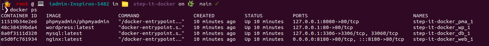
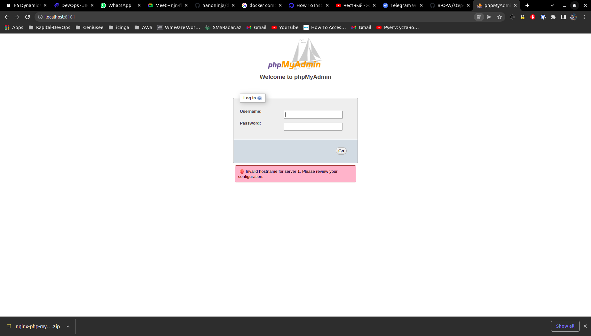
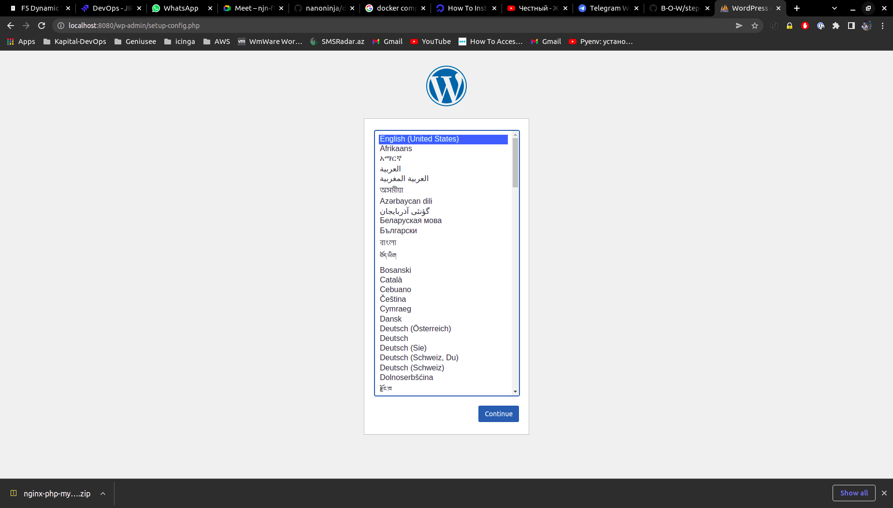

# step-it-docker

  
#Author Mammadov Elbrus
Test-Task


## Prerequisites
The README assumes some basic familiarity with Docker and docker-compose but does not assume any pre-existing deployment.

It also assumes that you are familiar with the normal docker up/build workflow.

To start using you will need:

- it is necessary that port 80,8080,8181 is not used
- to download docker/docker-compass
- and packages like live docker docker-compass
- and the dockerfile will do the rest

## Configure Docker

Copy the example environment into `.env`

```
cp env.example .env
```
Edit the `.env` file to change the default IP address, MySQL root password and WordPress database name.

```bash
$ docker-compose up -d 
$ docker ps 
```


## Check your dockers 




## Usage

### Starting containers

You can start the containers with the `up` command in daemon mode (by adding `-d` as an argument) or by using the `start` command:

```
docker-compose start
```

### Stopping containers

```
docker-compose stop
```

### Removing containers

To stop and remove all the containers use the`down` command:

```
docker-compose down
```

Use `-v` if you need to remove the database volume which is used to persist the database:

```
docker-compose down -v
```
