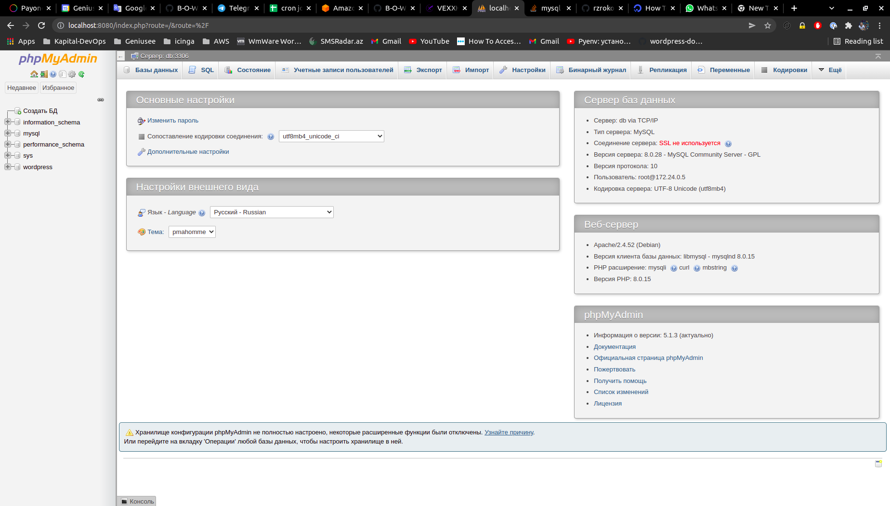
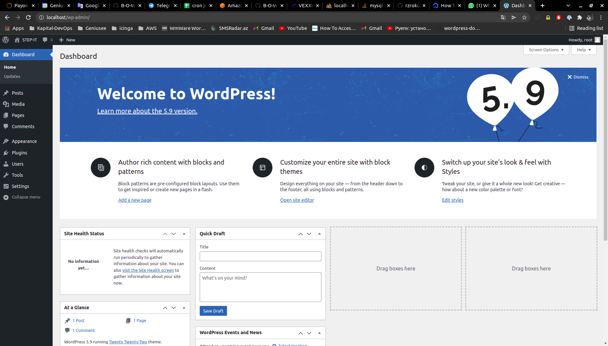

# step-it-docker

  
#Author Mammadov Elbrus
Test-Task


## Prerequisites
The README assumes some basic familiarity with Docker and docker-compose but does not assume any pre-existing deployment.

It also assumes that you are familiar with the normal docker up/build workflow.

To start using you will need:

- it is necessary that port 80,8080,8181 is not used
- to download docker/docker-compass
- and packages like live docker docker-compass
- and the dockerfile will do the rest

## Configure Docker

Copy the example environment into `.env`

```
cp env.example .env
```
Edit the `.env` file to change the default IP address, MySQL root password and WordPress database name.

```bash
$ docker-compose up -d 
$ docker ps 
```


## Check your dockers 



